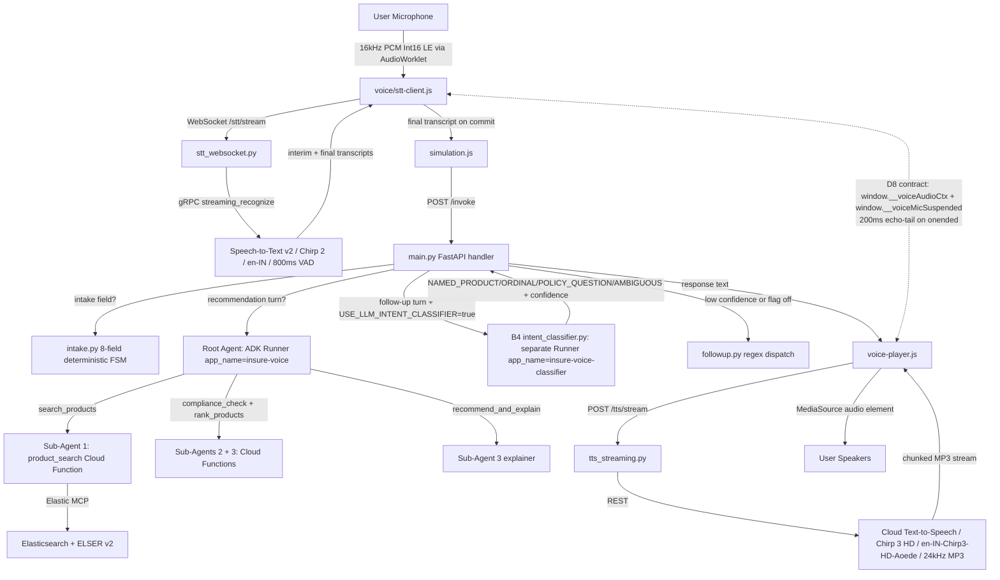

# InsureVoice — End-to-End Technical Documentation & Step-by-Step Manual

Welcome to **InsureVoice**, a state-of-the-art voice-first sales recommendation console designed for insurance matching, compliance checks, and persuasive objection handling.

This manual details the architecture, operations, local setup, and GCP Cloud Run deployment steps for the entire system.

> **Last updated**: 2026-06-10 (v7 — cover page + light theme UI on abhishek-final-branch. Server startup: `cd agent_builder && python -m uvicorn main:app --host 127.0.0.1 --port 8080 --reload` with `.env.local` loaded.)

---

## 1. Architectural Overview

### v7 Frontend Architecture (2026-06-10)

The v7 release introduces a two-page frontend served by the same FastAPI instance:

| URL | File | Description |
|---|---|---|
| `http://localhost:8080/` | `frontend/index.html` | Cover/landing page with product selector |
| `http://localhost:8080/agent` | `frontend/agent.html` | Light theme voice UI |
| `http://localhost:8080/app_dark` | `frontend/app_dark.html` | Original dark theme (preserved) |

`launchAgent()` in `index.html` navigates to `/agent` (same-origin, no absolute URL).

InsureVoice is a single-stack voice agent built on Google Cloud (FastAPI on Cloud Run + Vertex AI Gemini + Elasticsearch via MCP + Cloud Speech-to-Text v2 + Cloud Text-to-Speech Chirp 3 HD).

The Day 8 Tier B voice stack (in-tree on `stable_v4`, NOT yet deployed; live revision `00030-jc7` still serves the Day 7 browser-native baseline):



The mic-suspend / 200ms echo-tail D8 contract between `voice-player.js` and `voice/stt-client.js` prevents the speaker output from being transcribed back as user input.

---

## 2. Dynamic Conversational Mechanics

> **Note (Day 8 — 2026-06-05):** This section describes the Tier B voice path on `stable_v4`. The previously-shipped Dialogflow CX welcome flow has been removed end-to-end since Day 4 — the deployed agent uses a FastAPI `/invoke` handler with deterministic Python state machines for intake + follow-up dispatch, not Dialogflow CX. The browser-native Web Speech API STT + `SpeechSynthesisUtterance` TTS in the live revision `00030-jc7` is replaced by the Tier B Google Cloud voice stack in `stable_v4`.

### A. Mic capture (Tier B — `stable_v4`)
*   **Stack:** AudioWorklet running `agent_builder/frontend/voice/audio-worklet-processor.js` captures raw microphone audio at **16kHz PCM Int16 LE** and streams it over a WebSocket to the agent's `WebSocket /stt/stream` endpoint.
*   **Replaces:** browser-native `webkitSpeechRecognition` with a hardcoded 1.2s silence-debounce.

### B. Speech-to-Text + Voice Activity Detection (Tier B — `stable_v4`)
*   **Stack:** `agent_builder/stt_websocket.py` (549 lines) wraps Google Cloud **Speech-to-Text v2** with the **Chirp 2** model and en-IN locale. Server-side native voice-activity detection is tuned to **800ms** of trailing silence.
*   **Replaces:** the Day 7 client-side 1.2s silence-debounce timer in `simulation.js`. Mid-speech hesitations no longer truncate.
*   **Graceful failure:** if the runtime image does not have the `google-cloud-speech` package importable, the WebSocket handler responds `SDK_UNAVAILABLE` and the rest of the app keeps working.

### C. Text-to-Speech (Tier B — `stable_v4`)
*   **Stack:** `agent_builder/tts_streaming.py` (396 lines) calls Google Cloud **Text-to-Speech** with the Chirp 3 HD voice **`en-IN-Chirp3-HD-Aoede`** at 24kHz MP3, exposed at `POST /tts/stream`. The response is streamed in chunks; the browser plays it back through `agent_builder/frontend/voice-player.js` using a MediaSource-fed `<audio>` element. PoC measured 1.57s cold start.
*   **Rate limiting:** the endpoint has an in-memory per-IP `collections.deque` rate limiter at **30 req/min**; breaches return HTTP 429.
*   **Replaces:** `SpeechSynthesisUtterance` (browser local synthesis).

### D. D8 echo-cancellation contract (FE↔BE)
To prevent the mic from capturing TTS playback as user input ("agent transcribes its own voice"), the two FE modules coordinate via two `window` globals:

*   `window.__voiceAudioCtx` — the mic-capture AudioContext. **Published by B2** (`voice/stt-client.js`) on STT init. **Read only** by B1 (`voice-player.js`).
*   `window.__voiceMicSuspended` — boolean flag. **Initialized by B2**, **toggled** by B1 around playback.

Sequence on each TTS playback:

1. `<audio>.onplay` → B1 calls `window.__voiceAudioCtx.suspend()` → mic goes silent.
2. TTS completes → `<audio>.onended` → **B1 waits 200ms (echo-tail decay)** → calls `.resume()` → mic listens again.

The 200ms echo-tail before resume is intentional. Without it the mic captures the speaker echo's tail and re-transcribes the agent's own goodbye.

### E. Low-Latency Progressive Slot-Filling (unchanged from Day 5+)
*   The slot-extraction pipeline runs as deterministic Python in `agent_builder/intake.py` (8 fields, regex validators) and bypasses the LLM entirely on intake turns. Only the **pipeline turn** (after intake completes) hits the full search → compliance → rank → recommend chain on Gemini 2.5 Flash-Lite (root, temperature 0.25) + Gemini 2.5 Flash (`recommend_and_explain` sub-agent, temperature 0.3). Most user turns are sub-100ms.

### F. Optional LLM intent classifier on follow-up turns (Tier B B4 — `stable_v4`)
*   **Stack:** `agent_builder/intent_classifier.py` (565 lines). Gemini 2.5 Flash-Lite as a **separate sub-agent** with its own ADK `Runner` registered under `app_name="insure-voice-classifier"` (the root agent runs as `app_name="insure-voice"`). Returns one of `NAMED_PRODUCT` / `ORDINAL` / `POLICY_QUESTION` / `AMBIGUOUS` with a confidence score.
*   **Routing:** confidence ≥ 0.7 routes to the corresponding deterministic branch; (0.5, 0.7) is the force-clarify band; below 0.5 falls back to the legacy regex path in `followup.py`.
*   **Feature-flagged:** opt-in via the `USE_LLM_INTENT_CLASSIFIER=true` environment variable. Default off — agent uses regex follow-up dispatch as before.

---

## 3. Step-by-Step Local Setup & Execution

Follow these steps to run the application on your local machine:

### Prerequisites
*   Python 3.11+ installed.
*   Google Chrome (strongly recommended for Web Speech API support).
*   GCP SDK installed and authenticated (`gcloud auth application-default login`).

### Step 1: Clone the Codebase & Install Dependencies
Navigate to the agent directory and install the required libraries:
```bash
cd insure-voice-agent/agent_builder
pip install -r requirements.txt
```

The `requirements.txt` on `stable_v4` (Day 8) pins three Tier B packages that must be importable for the voice path to function end-to-end:

```
google-cloud-texttospeech>=2.14.1   # B1 — Chirp 3 HD TTS via POST /tts/stream
google-cloud-speech>=2.27.0          # B2 — Speech-to-Text v2 via WebSocket /stt/stream
google-genai==1.75.0                 # B4 — pinned for the classifier Runner (D11)
```

If `google-cloud-speech` is missing at import time, `WebSocket /stt/stream` returns `SDK_UNAVAILABLE` gracefully and the rest of the app keeps working, but the voice-input path is dead. Install the package and restart the process to recover.

### Step 2: Set up Environment Variables
Configure your GCP credentials and project environment parameters:
```powershell
# Windows PowerShell
$env:GCP_PROJECT_ID="voice-sales-agent"
$env:DIALOGFLOW_CX_AGENT_ID="7a051be1-2b54-40fd-ad3c-eb88ce0accbf"

# Linux / macOS
export GCP_PROJECT_ID="voice-sales-agent"
export DIALOGFLOW_CX_AGENT_ID="7a051be1-2b54-40fd-ad3c-eb88ce0accbf"
```

### Step 3: Launch the Local Server
Start the Flask application:
```bash
python app.py
```
The server will start on [http://127.0.0.1:8080](http://127.0.0.1:8080) (serving both the backend APIs and static frontend files).

---

## 4. Step-by-Step GCP Cloud Run Deployment

Deploy your local application directly to a secure, public Google Cloud Run URL:

### Step 1: Authenticate and Configure Project
```powershell
gcloud auth login
gcloud config set project voice-sales-agent
```

### Step 2: Trigger Source-Based Build and Deploy
Execute the deployment from the root directory (`insure-voice-agent/`):
```powershell
gcloud run deploy insure-voice-agent `
  --source . `
  --platform managed `
  --region us-central1 `
  --allow-unauthenticated `
  --set-env-vars="GCP_PROJECT_ID=voice-sales-agent,GOOGLE_CLOUD_PROJECT=voice-sales-agent,GOOGLE_CLOUD_LOCATION=us-central1,GOOGLE_GENAI_USE_VERTEXAI=1"
# Note (Day 8 — 2026-06-05): DIALOGFLOW_CX_AGENT_ID env var is no longer required.
# Dialogflow CX has been removed end-to-end. Optional Day 8+ env var:
#   --update-env-vars="USE_LLM_INTENT_CLASSIFIER=true"   # opt-in B4 classifier
```
*Gcloud will automatically analyze your `Dockerfile`, package the container, push it to Google Artifact Registry, and provision a serverless, secure Cloud Run instance.*

### Step 3: Retrieve Public Endpoint
Once complete, `gcloud` will output your public service URL:
```text
Service URL: https://insure-voice-agent-1055350728739.us-central1.run.app
```

---

## 5. File Registry & Code Paths for Git Commit

> **Updated 2026-06-05 (Day 8):** the layout below reflects the actual repo structure. The previous registry pointed at a `backend/app.py` + `frontend/*` split that does not exist — there is no separate `backend/` folder; the FastAPI app and FE bundle both live under `agent_builder/`.

| Component | Target File | Repo-relative Path |
| :--- | :--- | :--- |
| **FastAPI app entry** | `main.py` | `agent_builder/main.py` |
| **Root agent + sub-agents** | `agent_definition.py` | `agent_builder/agent_definition.py` |
| **Intake state machine** | `intake.py` | `agent_builder/intake.py` |
| **Follow-up regex + canonical farewell** | `followup.py` | `agent_builder/followup.py` |
| **B1 Tier B TTS** | `tts_streaming.py` | `agent_builder/tts_streaming.py` |
| **B2 Tier B STT WebSocket** | `stt_websocket.py` | `agent_builder/stt_websocket.py` |
| **B4 Tier B intent classifier** | `intent_classifier.py` | `agent_builder/intent_classifier.py` |
| **Shared session state** | `shared_state.py` | `agent_builder/shared_state.py` |
| **FE voice player (B1)** | `voice-player.js` | `agent_builder/frontend/voice-player.js` |
| **FE STT client (B2)** | `voice/stt-client.js` | `agent_builder/frontend/voice/stt-client.js` |
| **FE AudioWorklet (B2)** | `voice/audio-worklet-processor.js` | `agent_builder/frontend/voice/audio-worklet-processor.js` |
| **FE conversation engine** | `simulation.js` | `agent_builder/frontend/simulation.js` |
| **FE entry HTML** | `index.html` | `agent_builder/frontend/index.html` |
| **FE bootstrap** | `app.js` | `agent_builder/frontend/app.js` |
| **Deployment Spec** | `Dockerfile` | `Dockerfile` (repo root) |
| **CI/CD** | `cloudbuild.yaml` | `infra/cloudbuild.yaml` |
| **Manual / Guides** | `END_TO_END_MANUAL.md` | `documentation/END_TO_END_MANUAL.md` |
| **Phase 1 changelog** | `README_CHANGES.md` | `README_CHANGES.md` (repo root) |
| **Architecture doc** | `ARCHITECTURE.md` | `docs/ARCHITECTURE.md` |
| **Tier B plan** | `VOICE_AGENT_IMPROVEMENT_PLAN.md` | `docs/VOICE_AGENT_IMPROVEMENT_PLAN.md` |

### To Stage and Commit to your Github Branch:
```powershell
# Navigate to the repository root (use the worktree on stable branch — see Day 8 push plan)
cd "c:/Users/INILPTP088/OneDrive - inadev.com/Work/Datalabs/Hackathon_Insure_Voice_Agent/insure-voice-agent_atgoel"

# Check status of modified files
git status

# Stage explicit paths (Day 8 Tier B example)
git add agent_builder/main.py
git add agent_builder/tts_streaming.py
git add agent_builder/stt_websocket.py
git add agent_builder/intent_classifier.py
git add agent_builder/followup.py
git add agent_builder/requirements.txt
git add agent_builder/frontend/voice-player.js
git add agent_builder/frontend/voice/
git add agent_builder/frontend/simulation.js
git add agent_builder/frontend/index.html
git add tests/test_intent_classifier.py
git add tests/test_b2_resume_tail.py
git add tests/fixtures/bug_j_golden.json
git add documentation/END_TO_END_MANUAL.md
git add docs/ARCHITECTURE.md docs/VOICE_AGENT_IMPROVEMENT_PLAN.md
git add README.md README_CHANGES.md

# Commit changes
git commit -m "docs: resolve stuck voice loop, slow backend model, and welcome greeting from Dialogflow CX"

# Push to your Github branch
git push origin <your-branch-name>
```
